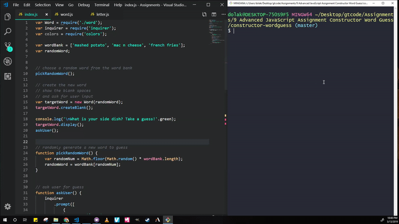

# constructor-wordguess

This project is a version of Hangman using Node.js to run Javascript code from the command line. The game uses a similar logic to the front-end application I created that can be found here: https://dolaku.github.io/word-guess-game/

## npm packages:
  * `inquirer`: https://www.npmjs.com/package/inquirer
    * A collection of common interactive command line user interfaces.
  * `colors`: https://www.npmjs.com/package/colors
    * Ability to get color and style in your node.js console.

## See how it works:
